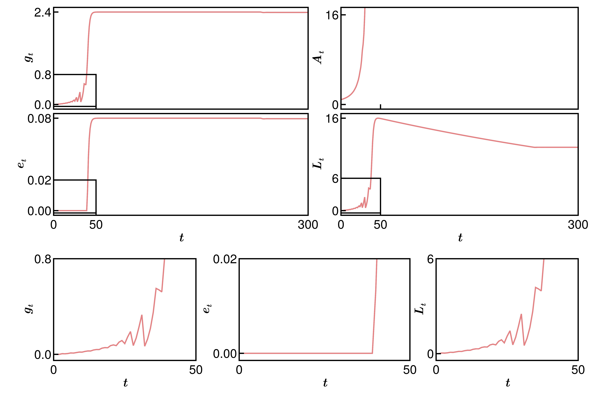

# A systematic analysis of the dynamics of a model of unified growth

## 🚀 Description 

Unified growth theory (UGT) is a model proposed in [Galor and Weil 2000](https://www.aeaweb.org/articles?id=10.1257/aer.90.4.806) and used by macroeconomists to explain the three main stages of population growth and technological progress throughout civilisations.
This model's cornestone is the optimisation of a utility function reppresenting the tradeoff between each agaent's choice of allocatin resources to consumption or child-rearing activities.
Such optimisation problem is dynamic, in the sense that it updates through (discrete-time) iterations for the optimal choice of the agents' number of offspring and level of education of said children at each generation.
This gives rise to a 4-dimensional, piece-wise defined, non-smooth map whose dynamics is only given in the abstract sense (i.e. no explicit functional form is proposed but rather a set of conditions for them is specified).
Later efforts [Lagerlöf 2006](https://www.aeaweb.org/articles?id=10.1257/aer.90.4.806) have put this model into numerical simulations to showcase the expected behaviour and properties of the model.

### ✏️📋 Outline

A systematic , phase space and bifurcation analysis of the model is still lacking from the literature in both mathematics and economics. We seek to fill such gap providing rigorous mathematical grounding to the properties observed by others' simulations while refining some aspects of the model to produce new results.

## 📦 Structure of the repo

This repository is organised as follows

```bash
root/
├── doc/                # LaTeX source code and compiled PDF of the arXiv preprint 
├── exp/                # Collection of subdirectories associated one-to-one to an experiment/figure in the paper 
├── res/                # Figures and data generated by the scripts in the subdirs of exp/  
├── src/                # Modules collecting the source code of the experiments 
├── test/               # (When present) unit testing of the functions in utils/ 
└── utils/              # Functions used to implement the algorithms used to generate the res/ 
```

### ⚙️🛠️ Organisation of the experiments

In `exp` you'll find many subdirs, each associated one-to-one with an important experiment and/or a picture in the paper. The code in each subdir is organised acoording to the following structure

```bash
experiment/
├── scripts/             
│   ├── figs.jl         # Customise the layouts of the figures
│   ├── plot.jl         # Create the plots in each figure
│   ├── proc.jl         # Postprocess the results of a simulation (usually this is the main algorithm)
│   └── sim.jl          # Definition of the system and settings of the problem
├── inc.jl              # Load the modules in src/ and include all the other libraries
└── main.jl             # File to run to execute the simulation, analyse the results and export the figures
```

### 💡🔬 What does each experiment do?

What follows is a brief description of those experiments so that you can gather their functionalities without interpreting the code in it:

- [lagerlof](./exp/lagerlof/): simulations of the "_time-paths_" of the UGT with Lagerlöf explicit function forms to replicate the results shown in [[Lagerlöf 2006]](https://www.sciencedirect.com/science/article/abs/pii/S1094202505000566).


