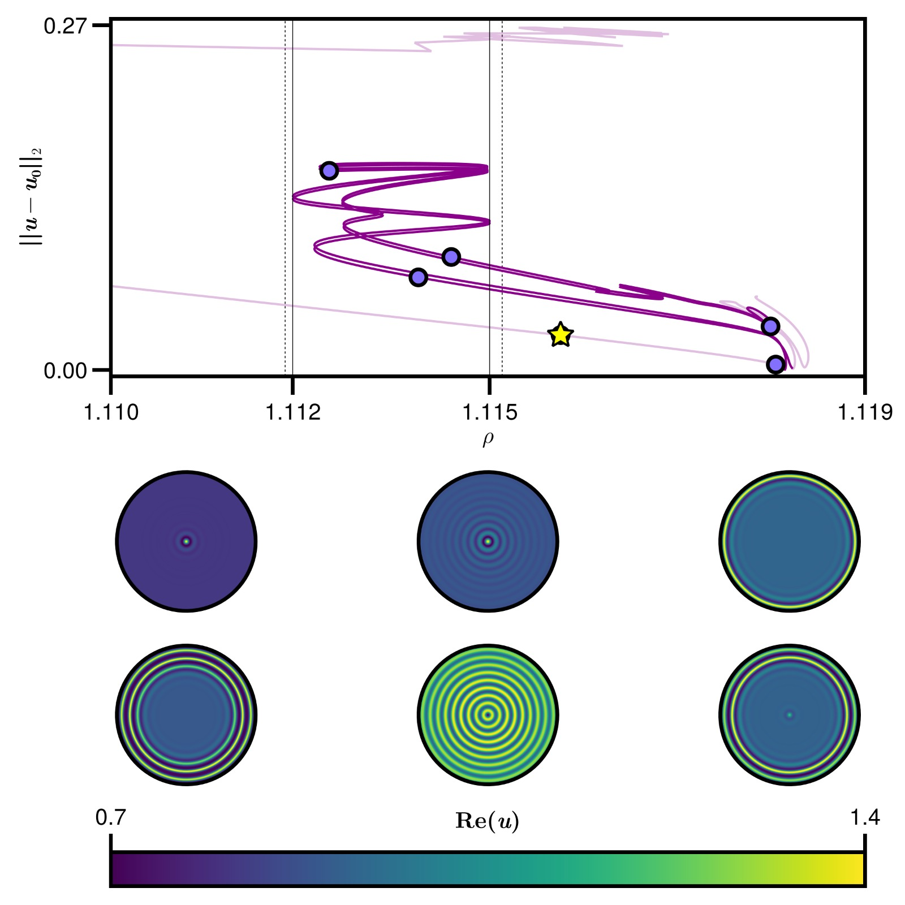

# Localised patterns of the Lugiato-Lefever equation (LLE) in 2 dimensions

## 🚀 Description 

Time-dependent, reaction-diffusion equations are known to produce spatially patterned solutions as steady states [[Peletier and Troy 2001]](https://link.springer.com/book/10.1007/978-1-4612-0135-9).
A systematic way to characterise these solutions is to think of them as spatially localised patterns (pulses) that undergo homoclinic snaking in the bifurcation diagram of the spatial dynamics [[Burke and Knobloch 2007]](https://www.sciencedirect.com/science/article/pii/S0375960106013612).
The LLE is a model from quantum physics that underpins the evolution of light pulses with several, important applications in nonlinear optics and laser models [[Cardoso et al. 2017]](https://www.nature.com/articles/s41598-017-16981-3).
It has been empirically demonstrated [[Parra-Rivas et al. 2018]](https://journals.aps.org/pre/abstract/10.1103/PhysRevE.97.042204) that the LLE in one spatial dimension does show homoclinic snaking of pulses in the energy injection (damping) parameter.
The existence and stability of these stationary pulses was recently proved in [[Bengel et al. 2025]](https://www.sciencedirect.com/science/article/pii/S0167278925003999).

### ✏️  Outline

__Collaborators:__ Samuel Bolduc St-Aubin (U. of Auckland, New Zealand), Daniel Fassler (Concordia, Canada), Marco Calabrese (UMass Amherst, US). 

We investigate the existence of spatial pulse solutions for the LLE in a radially symmetric 2-dimensional domain.
The change of coordinates in the polar frame allows us to rewrite the Laplacian operator Δ = ∂xx + ∂yy in a split-component fashion Δr = ∂rr + (1/r)∂r + (1/r^2)∂θ.
Because of the radial symmetry the last term is set to 0 and we can parametrise the radial component (1/r)∂r with ν to perform a homotopy continuation for a spatial pulse in one dimension, to find its counterpart in two dimensions.
We are able to perform a successfull homotopy continuation in the two dimensional polar domain and investigate the properties of its solution.

This project is currently at a _preliminary investigation_ stage!

### 📜 How to cite

The numerical method underlying the continuation of a discretised PDE is implemented by Daniele Avitabile. Please cite his work as

```bash
@misc{avitabile2020,
  author = {Daniele Avitabile},
  title = {{Numerical Computation of Coherent Structures in Spatially-Extended Systems}},
  month = May,
  year = 2020,
  publisher = {Zenodo},
  version = {v1.2-alpha},
  doi = {10.5281/zenodo.3821169},
  url = {https://doi.org/10.5281/zenodo.3821169}
}
```

This work has been the result of a 2 weeks [Summer School in pattern formation](https://www.siam.org/publications/siam-news/articles/frontiers-in-multidimensional-pattern-formation-recapping-the-2025-gene-golub-siam-summer-school/) organised and funded by the Society of Applied and Industrial Mathematics (SIAM).

## 📦 Structure of the repo

This repository is organised as follows

```bash
root/
├── inc/                # Include scripts importing local functions in src/
├── res/                # Figures and animations obtained by the results of sim/ 
├── sim/                # Actual numerical simulations of the work
└── src/                # Reusable functions implementing the algorithms used in sim/
```

### ⚙️  Organisation of the experiments

The actual numerical continuation algorithm for the pattern-forming PDE is implemented in MATLAB by [Daniele Avitabile](https://www.danieleavitabile.com/numerical-computation-of-coherent-structures-in-spatially-extended-systems/).

```bash
sim/
├── data/               # Results of the secant continuation of the files in main/ stored in the .mat format 
├── main                # Numerical continuation scripts and local copy of Daniele Avitabile's code
└── plotting            # Plotting routines of the continuation in 1 and 2 dimensions
```

### 💡 What does each experiment do?

What follows is a brief description of the numerical experiments so that you can understand their purpose without interpreting it from the code:

- `fig:snaking_1d`: bifurcation diagram in the L2-norm of steady-state solutions of the LLE in 1 dimension showing homoclinic snaking [[Parra-Rivas et al. 2018]](https://journals.aps.org/pre/abstract/10.1103/PhysRevE.97.042204). Candidate solutions (yellow stars) are selected to continue them in the second dimension via homotopy.


- `fig:homotopy_continuation_step_xxx`: continuation in 2 dimensions of selected solutions of the bifurcation diagram above

| Unsuccesfull homotopy | Succesfull homotopy |
| --------------------- | ------------------- |
|        |      |

- `fig:snaking_2d`: bifurcation diagram of the steady-state obtained via succesfull homotopy continuation from the 1-dimensional pattern (yellow star)

| Bifurcation diagram in 2d      | |
| --------------- | -------------- |
|  |  |
